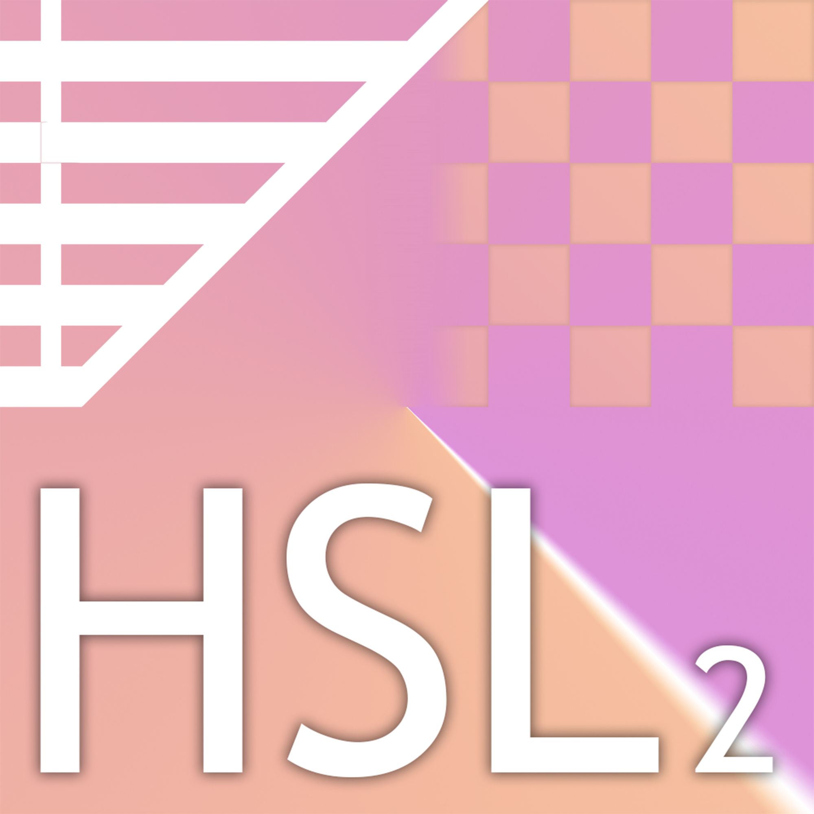
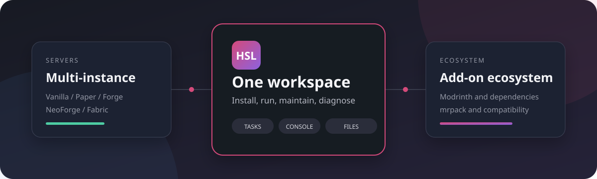

# Hikari Server Launcher 2

**把 Minecraft 服务器的安装、运行、维护与扩展管理放进一个现代桌面工作区。**

[English](README_EN.md) · [安装指南](docs/INSTALL.zh-CN.md) · [使用指南](USAGE.md) · [参与贡献](CONTRIBUTING.md)

HSL2 是一套面向 Minecraft 服主的桌面管理工具。它负责准备 Java 与服务端文件、管理多个实例，并把终端、文件、配置、备份、市场和诊断集中在同一套工作区中。前端与后端可以部署在同一台电脑，也可以分离运行。

## 为什么选择 HSL2

| 安装与运行 | 日常维护 | 扩展生态 |
| --- | --- | --- |
| 支持 Vanilla、Paper、Forge、NeoForge、Fabric | WebSocket 实时终端、任务进度与下载速度 | Modrinth 模组与插件市场 |
| 自动准备 Java 和服务端运行文件 | 文件管理、配置编辑、备份与恢复 | 兼容版本筛选与前置依赖安装 |
| 图形化启动器，可独立启动前端或后端 | EULA、正版验证、距离配置与兼容性诊断 | `.mrpack` 导入与服务端不兼容项过滤 |

## 主要能力

- **多实例工作区** — 创建、启动、停止并维护不同类型和版本的服务器。
- **实时任务系统** — 通过 WebSocket 推送阶段、子任务、进度、速度和失败原因。
- **服务器控制台** — 查看实时日志、发送命令，并管理服务器进程生命周期。
- **模组与插件市场** — 按服务器类型和版本搜索、筛选并安装 Modrinth 项目。
- **附加内容管理** — 识别模组、插件及 Jar-in-Jar 元数据，支持启用、编辑和删除。
- **模组包导入** — 读取 `.mrpack`，复查 overrides，并排除不适用于服务端的内容。
- **发布前诊断** — 检查 EULA、online-mode、依赖、环境兼容性和高负载配置。
- **中国大陆网络适配** — 提供镜像来源选择及针对运营商网络环境的诊断信息。

## 工作方式

  

HSL2 由桌面应用、图形化启动器和后端服务组成。启动器可以一键运行完整环境，也可以只启动前端或后端；后端还可以设置为 Windows 登录后自动启动。桌面应用使用悬浮工作区入口，让服务器管理页面按需打开，而不必长期占用一个大型主窗口。

## 开始使用

前往 [Releases](https://github.com/Hikari16665/HikariServerLauncher2/releases) 下载 Windows 安装器，然后按照[中文安装指南](docs/INSTALL.zh-CN.md)完成首次启动。

> HSL2 当前以 Windows x64 为主要发布目标。首次连接时请妥善保存启动器显示的管理密钥；获得该密钥的人可能拥有后端管理权限。

## 技术基础

| 桌面端 | 后端 | 实时与数据 |
| --- | --- | --- |
| Tauri 2、Rust、React、TypeScript、Vite | Python、Flask、PyInstaller | WebSocket、Zustand、Modrinth API |

## 文档

- [安装指南（中文）](docs/INSTALL.zh-CN.md)
- [Installation Guide (English)](docs/INSTALL.en.md)
- [使用指南](USAGE.md)
- [API 文档](API_DOC.md)
- [贡献指南](CONTRIBUTING.md)
- [GPL-3.0 许可证](LICENSE)

## 参与项目

欢迎提交问题、功能建议和代码贡献。提交变更前请阅读[贡献指南](CONTRIBUTING.md)，并确保后端测试、前端 lint、Rust 测试与生产构建均通过。

---

由 <a href="https://github.com/Hikari16665">Hikari16665</a> 维护 · 基于 <a href="https://github.com/HikariRevivalProject/HikariServerLauncher">Hikari Server Launcher</a> 延续开发

